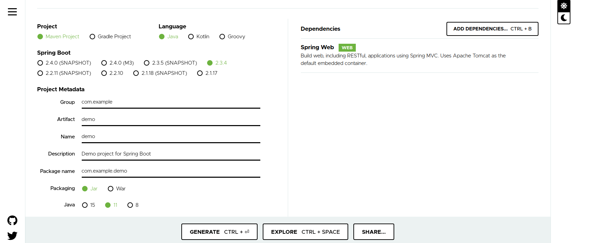

# Webapp<!-- omit in toc -->
coderevie10

- [Prerequisites for building and deploying](#prerequisites-for-building-and-deploying)
  - [You should have JDK with 8+](#you-should-have-jdk-with-8)
  - [You will nedd Maven in order to complie the project](#you-will-nedd-maven-in-order-to-complie-the-project)
  - [The project starts from Spring init(You don't need to do this step)](#the-project-starts-from-spring-inityou-dont-need-to-do-this-step)
- [Build and Deploy instructions](#build-and-deploy-instructions)
  - [Use maven clean install](#use-maven-clean-install)
  - [Start tomcat server](#start-tomcat-server)
  - [Mysql](#mysql)

Zixiao Wang  
CSYE 6225

## Prerequisites for building and deploying

### You should have JDK with 8+

install the default JAVA version

```shell script

sudo apt update

sudo apt install default-jre

sudo apt install default-jdk

```

Set the environment

```shell script

sudo update-alternatives --config java # check the installed path

sudo vi /etc/environment # add one line like JAVA_HOME="/usr/lib/jvm/java-11-openjdk-amd64"

source /etc/environment

echo $JAVA_HOME # test if the environment is correct
# It should show like "/usr/lib/jvm/java-11-openjdk-amd64"
```

### You will nedd Maven in order to complie the project

```shell script
sudo apt install maven
```

### The project starts from Spring init(You don't need to do this step)

[Spring initializr](https://start.spring.io/)



## Build and Deploy instructions

### Use maven clean install

```shell script
# You should change your directory to "/webapp/webapp" like this 
pwd
# "your files"/webapp/webapp

# Then use maven
sudo mvn clean install
# This will finally show "BUILD SUCCESS"
```

### Start tomcat server

```shell script
# Go to "target" directory
cd target

# You will see the .jar file like
# webapp-0.0.1-SNAPSHOT.jar

# Then use following command to start the web service
java -jar webapp-0.0.1-SNAPSHOT.jar
# Then open your browser and input "localhost:8080"
# Your shall see the "Hello World!"

# And there is a production env
java -jar webapp-0.0.1-SNAPSHOT.jar --spring.profiles.active=prod
# Then open your browser and input "localhost:4431"
# Your shall see the "Hello World!"


```


### Mysql

```shell script
sudo apt install mysql
```

You should also create following db and tables.

```sql
CREATE SCHEMA `webapp` ;

CREATE TABLE `webapp`.`User` (
  `id` INT NOT NULL,
  `emailAddress` VARCHAR(45) NOT NULL,
  `password` VARCHAR(45) NOT NULL,
  `firstName` VARCHAR(45) NOT NULL,
  `lastName` VARCHAR(45) NOT NULL,
  `accountCreated` VARCHAR(45) NOT NULL,
  `accountUpdated` VARCHAR(45) NOT NULL,
  PRIMARY KEY (`id`),
  UNIQUE INDEX `emailAddress_UNIQUE` (`emailAddress` ASC));
```
